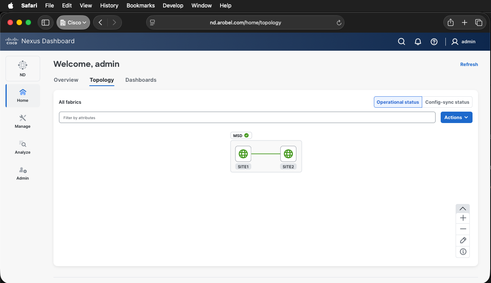

# ndfc-python

This repository contains Python classes and example scripts for interacting
with Cisco's Nexus Dashboard Fabric Controller (NDFC) via its REST API.

We've moved our documentation to GitHub Pages

[https://allenrobel.github.io/ndfc-python/](https://allenrobel.github.io/ndfc-python/)

However a basic quick start guide to this repository follows, intended for those who
have not yet installed the Cisco DCNM Ansible collection.

The ndfc-python repository shares Python code with the DCNM Ansible collection,
so this collection is a dependency.  Note, we do not use anything related
to Ansible.  ndfc-python is, as the name implies, pure Python.

## 1. Create a $HOME/repos directory into which we'll clone ndfc-python

```bash
mkdir $HOME/repos
```

## 2. Clone the ndfc-python repository

```bash
cd $HOME/repos
git clone https://github.com/allenrobel/ndfc-python.git
```

## 3. Clone the ansible-dcnm repository

We want this repository to follow the standard Ansible path structure.

```bash
cd $HOME/repos
mkdir ansible
mkdir ansible/collections
mkdir ansible/collections/ansible_collections
mkdir ansible/collections/ansible_collections/cisco
cd ansible/collections/ansible_collections/cisco
git clone https://github.com/CiscoDevNet/ansible-dcnm.git
# We need to rename the resulting directory from ansible-dcnm to dcnm
mv ansible-dcnm dcnm
```

## 4. Install Python if it is not already installed

[python.org Downloads](https://www.python.org/downloads/)

## 5. Create a virtual environment

```bash
cd $HOME/repos/ndfc-python
# If python is in your path
python -m venv .venv --prompt ndfc-python
# If python is NOT in your path, and it was installed on MacOS
/Library/Frameworks/Python.framework/Versions/3.13/bin/python3 -m venv .venv --prompt ndfc-python
```

## 6. Source the virtual environment

- `source .venv/bin/activate`

```bash
arobel@AROBEL-M-G793 ndfc-python % source .venv/bin/activate
(ndfc-python) AROBEL-M-G793%
```

## 7. upgrade pip

```bash
pip install --upgrade pip
```

## 8. Install uv

```bash
pip install uv
```

## 9. Use uv to install the other dependencies

```bash
uv sync
```

## 10. Set required environment variables

```bash
# Edit $HOME/repos/ndfc-python/env/02-nd
# Change the following to match your environment
# ND_IP4=<your Nexus Dashboard IPv4 address>
# ND_USERNAME=<your Nexus Dashboard username, typically admin>
# ND_PASSWORD=<your Nexus Dashboard password for ND_USERNAME>
# NXOS_USERNAME=<The username of your Nexus switches, typically admin>
# NXOS_PASSWORD=<The password of your Nexus switches associated with NXOS_USERNAME>
#
# NOTE: For better security, follow the steps at Github Pages link at the top of this file.
#
# Once 02-nd is edited, source the following file (it, in turn, sources the other files)

source $HOME/repos/ndfc-python/env/env
```

## 11. Optionally, enable logging

```bash
export NDFC_LOGGING_CONFIG=$HOME/repos/ndfc-python/lib/ndfc_python/logging_config.json
```

## 12. Run a script that does not take any arguments

Let's try the login script since it does not require any arguments.

```bash
cd $HOME/repos/ndfc-python
source .venv/bin/activate
source env/env
cd examples
./login.py
```

## 13. Potential Ansible locale error

If you see the following error.

```bash
ERROR: Ansible requires the locale encoding to be UTF-8; Detected ISO8859-1
```

You can fix it by updating a couple environment variables.

On macOS

```bash
export LC_ALL=en_US.UTF-8
export LANG=en_US.UTF-8
```

On Ubuntu

Check if the locales are installed.

```bash
(ndfc-python) arobel@glide:~/repos/ndfc-python$ locale -a | grep -i utf
C.utf8
en_US.utf8
(ndfc-python) arobel@glide:~/repos/ndfc-python$
```

If not, generate them.

```bash
sudo locale-gen en_US.UTF-8
```

Verify your locale is set.  If any of the following environment variables are set to something else,
change them with `export VAR="en_US.UTF-8"`

```bash
(ndfc-python) arobel@glide:~/repos/ndfc-python$ locale
LANG=en_US.UTF-8
LANGUAGE=
LC_CTYPE="en_US.UTF-8"
LC_NUMERIC="en_US.UTF-8"
LC_TIME="en_US.UTF-8"
LC_COLLATE="en_US.UTF-8"
LC_MONETARY="en_US.UTF-8"
LC_MESSAGES="en_US.UTF-8"
LC_PAPER="en_US.UTF-8"
LC_NAME="en_US.UTF-8"
LC_ADDRESS="en_US.UTF-8"
LC_TELEPHONE="en_US.UTF-8"
LC_MEASUREMENT="en_US.UTF-8"
LC_IDENTIFICATION="en_US.UTF-8"
LC_ALL=
(ndfc-python) arobel@glide:~/repos/ndfc-python$
```

## 14. Run a script that requires a config file

Many of the scripts take a config file.

Example config files are located in `$HOME/repos/ndfc-python/examples/config/*.yaml`

Let's edit a config that creates a VRF.

```bash
cd $HOME/repos/ndfc-python
source .venv/bin/activate
source env/env
cd examples
vi $HOME/repos/ndfc-python/examples/config/config_vrf_create.yaml
```

Below is the content of this file.

```yaml
---
config:
  - fabric_name: MyFabric1
    vrf_display_name: MyVrf1
    vrf_id: 50005
    vrf_name: MyVrf1
    vrf_vlan_id: 3005
  - fabric_name: MyFabric1
    vrf_display_name: MyVrf2
    vrf_id: 50006
    vrf_name: MyVrf2
    vrf_vlan_id: 3006
```

Above, we are creating two VRFs in MyFabric1.

Modify this to match your environment by changing each item's parameters.

Since my local environment contains two child fabrics within a multi-site domain fabric,
the VRFs need to be created in the parent MSD fabric, rather than the child fabrics.



Below are the edits for my environment.

```yaml
---
config:
  - fabric_name: MSD
    vrf_display_name: ndfc-python-vrf1
    vrf_id: 50005
    vrf_name: ndfc-python-vrf1
    vrf_vlan_id: 3005
  - fabric_name: MSD
    vrf_display_name: ndfc-python-vrf2
    vrf_id: 50006
    vrf_name: ndfc-python-vrf2
    vrf_vlan_id: 3006
```

Save the file and then execute the associated script.

First, we'll have a look at the help facility that all scripts provide.

```bash
cd $HOME/repos/ndfc-python/examples
(ndfc-python) arobel@Allen-M4 examples % ./vrf_create.py --help
usage: vrf_create.py [-h] [-v ANSIBLE_VAULT] -c CONFIG [-l {INFO,WARNING,ERROR,DEBUG}] [--nd-domain ND_DOMAIN] [--nd-ip4 ND_IP4] [--nd-password ND_PASSWORD] [--nd-username ND_USERNAME]

DESCRIPTION: Create a vrf.

options:
  -h, --help            show this help message and exit

OPTIONAL ARGS:
  -v, --ansible-vault ANSIBLE_VAULT
                        Absolute path to an Ansible Vault. e.g. /home/myself/.ansible/vault.
  --nd-domain ND_DOMAIN
                        Login domain for the Nexus Dashboard controller. If missing, the environment variable ND_DOMAIN or Ansible Vault is used.
  --nd-ip4 ND_IP4       IPv4 address for the Nexus Dashboard controller. If missing, the environment variable ND_IP4 or Ansible Vault is used.
  --nd-password ND_PASSWORD
                        Password for the Nexus Dashboard controller. If missing, the environment variable ND_PASSWORD or Ansible Vault is used.
  --nd-username ND_USERNAME
                        Username for the Nexus Dashboard controller. If missing, the environment variable ND_USERNAME or Ansible Vault is used.

MANDATORY ARGS:
  -c, --config CONFIG   Absolute path to a YAML configuration file. e.g. /home/myself/myfile.yaml

DEFAULT ARGS:
  -l, --loglevel {INFO,WARNING,ERROR,DEBUG}
                        Logging level
(ndfc-python) arobel@Allen-M4 examples %
```

From above, we see that we can override, on a script-by-script basis, the environment variables we configured earlier.

We also see that the `--config` argument is mandatory.  This points to the config file we just edited.  Let's use our
existing environment variables and provide only the `--config` argument.

- `./vrf_create.py --config $HOME/repos/ndfc-python/examples/config/config_vrf_create.yaml`

Let's first disable debugging for shorter output.

```bash
(ndfc-python) arobel@Allen-M4 examples % unset NDFC_LOGGING_CONFIG
(ndfc-python) arobel@Allen-M4 examples %
```

Here is the current set of VRFs in the MSD fabric in my setup.


Now let's run the script.

```bash
(ndfc-python) arobel@Allen-M4 examples % ./vrf_create.py --config $HOME/repos/ndfc-python/examples/config/config_vrf_create.yaml
Created vrf ndfc-python-vrf1 in fabric MSD
Created vrf ndfc-python-vrf2 in fabric MSD
(ndfc-python) arobel@Allen-M4 examples %
```


## 15. Save the configuration

The previous script pushed a configuration to Nexus Dashboard, but did not save it.

Let's run a script to save this configuration into Nexus Dashboard's database.

```bash
(ndfc-python) arobel@Allen-M4 examples % ./config_save.py --config test_config_save.yaml
Triggering Config Save for fabric 'SITE1'
Config save is completed
Triggering Config Save for fabric 'SITE2'
Config save is completed
Triggering Config Save for fabric 'MSD'
Config save is completed
(ndfc-python) arobel@Allen-M4 examples %
```

## 16. Deploy the configuration

The previous script saved the configuration.  We'll now deploy the configuration.

```bash
(ndfc-python) arobel@Allen-M4 examples % ./config_deploy.py --config test_config_deploy.yaml
Triggering Config Deploy for fabric 'SITE1'
Configuration deployment completed for fabric [SITE1].
Triggering Config Deploy for fabric 'SITE2'
Configuration deployment completed for fabric [SITE2].
Triggering Config Deploy for fabric 'MSD'
Configuration deployment completed for fabric [MSD].
(ndfc-python) arobel@Allen-M4 examples %
```


## 17. Script Documentation

Follow the link below to access the documentation for the above VRF script.

The other scripts are similarly documented on the same page.

[Script Documentation](https://allenrobel.github.io/ndfc-python/scripts/vrf_create/)
